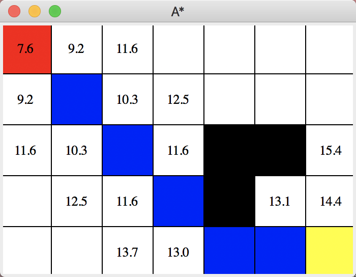

# A-star-maze

A python implementation of A* (A star) algorithm for find a shortest path in a maze.



```shell script
python3 main.py --width 10 --height 8 
```

After the window shows up, first click a square to select start point, then select an end point, then the position to put walls.
Lastly, hit space key and wait for a solution.
